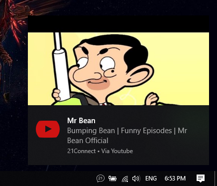
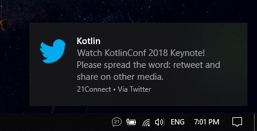

#  

21Connect help you to connect your android smart phone or tablet with your Windows (8.1 and above) PC. 

Integrates:

- Calls
- Notifications
- Low battery

[Android App](https://github.com/tsvetilian-ty/21Connect-Android-App)

[Download for Windows](https://github.com/tsvetilian-ty/21Connect/releases)

## Contents

- [Usage](#usage)
- [Build](#build)
- [Apps with custom views](#apps)
- [License](LICENSE.md)

## Usage

Install dependencies:

```console
$ npm install
```

Run the app:

```console
$ npm start
```

## Build

At the moment only Windows build script is available:

```console
$ npm run build:win
```

## Apps

Notifications from Youtube, Discord, Facebook, Instagram, Messanger, Twitter and Vider have icons or special view you can view them in.




